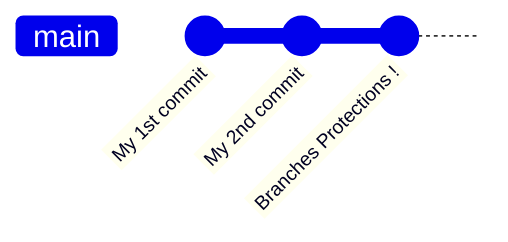
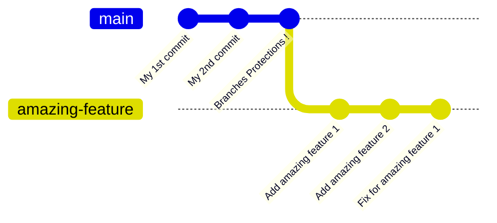
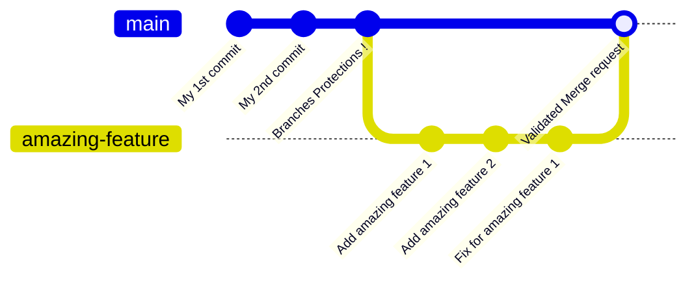

# Git & GitHub


## Table of contents

- [Create new branches](#createNewBranch)
  - [On GitHub](#cnbGithub)
  - [On local machine](#cnbLocal)
- [Create pull requests](#createPR)

## Quick explanation about branches and branches protection

The `main` branch is currently protected which mean it is impossible to push any commit directly to this branch on GitHub. (You can make commits locally but when pushing, github will reject the push request)  
To make changes on the main branch, you will have to make theses changes on a new branch first, and then create a `Pull request` to merge the changes from the branch you created to the `main` branch.
All the current pending pull requests are shown in the `Pull requests` tab on the top menu.  

### Example :

Let's say I have a new project :


I now have a `main` branch with 3 commits, and the `main` branch have a protection that prevents me from pushing directly to it.  
If I want to add a new feature `amazing feature`. I will now have to create a new branch and make all the changes in this branch.  



Now that I finished developing my feature and it is ready for production, I can merge the branch `amazing-feature` to the `main` one.  
But since the `main` branch is also protected against merges, that's where I have to create a `Pull request` (or `merge request` on gitlab).  
This will force other to review my code and validate it. Once I have two validation, i can then merge my branch to the `main` one and the feature will be added to the project permanantly !




## <a name="createNewBranch"></a> Create new branches

To create a new branches for your feature you have two choice, either **on github** or **locally**.

### <a name="cnbGithub"></a> Create the new branch on GitHub

To create a new branch on GitHub you have to press the `branch` button (which is on top of the repo files) and then `View all branches` :  


You will now be on the `branches` pages, and you'll just have to click on the `New branch` button and that's it ! 


Now, you'll just need to pull these changes on your local machine with 
```git pull``` 
and switch to the new branch you created with
```git checkout [branch-name]```

### <a name="cnbLocal"></a> Create the new branch locally

You can also create the branch on your local machine and then switch to that branch : 
```
git branch [branch-name]
git checkout [branch-name]
```
(or in one command `git checkout -b [branch-name]`)

Then you can make the commits you wants, and push this branch to the GitHub repo :
```
git push -u origin [branch-name]
```

## <a name="createPR"></a> Create pull requests
