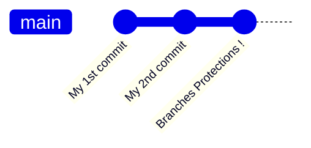
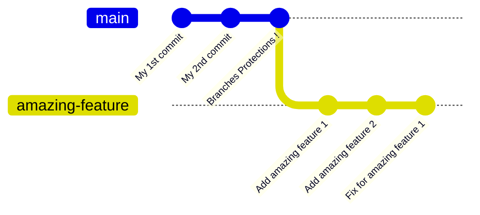
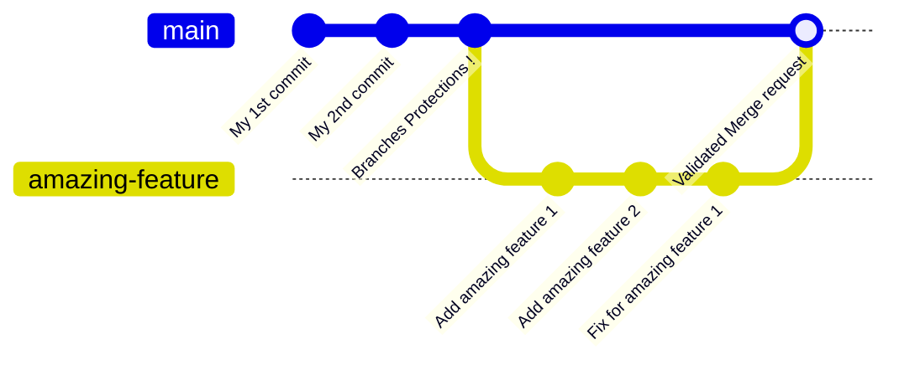

# Git & GitHub


## Table of contents

- [Create new branches](#createNewBranch)
  - [On GitHub](#cnbGithub)
  - [On local machine](#cnbLocal)
- [Create pull requests](#createPR)
- [Review pull requests](#reviewPR)

## Quick explanation about branches and branches protection

The `main` branch is currently protected which mean it is impossible to push any commit directly to this branch on GitHub. (You can make commits locally but when pushing, github will reject the push request)  
To make changes on the main branch, you will have to make theses changes on a new branch first, and then create a `Pull request` to merge the changes from the branch you created to the `main` branch.
All the current pending pull requests are shown in the `Pull requests` tab on the top menu.  

### Example :

Let's say I have a new project :


I now have a `main` branch with 3 commits, but the `main` branch have a protection that prevents me from pushing directly to it.  
If I want to add a new feature `amazing feature`, I will now have to create a new branch and make all the changes in this branch.  



Now that I finished developing my feature and it is ready for production, I can merge the branch `amazing-feature` to the `main` one.  
But since the `main` branch is also protected against merges, that's where I have to create a `Pull request` (or `merge request` on gitlab).  
This will force other collaborators to review my code and approve it. Once I have two approvals, i can then merge my branch to the `main` one and the feature will be added to the project permanantly !




## <a name="createNewBranch"></a> Create new branches

To create a new branches for your feature you have two choice, either **on github** or **locally**.

### <a name="cnbGithub"></a> Create the new branch on GitHub

To create a new branch on GitHub you have to press the `branch` button (which is on top of the repo files) and then `View all branches` :  


You will now be on the `branches` pages, and you'll just have to click on the `New branch` button and that's it ! 


Now, you'll just need to pull these changes on your local machine with 
```git pull``` 
and switch to the new branch you created with
```git checkout [branch-name]```

### <a name="cnbLocal"></a> Create the new branch locally

You can also create the branch on your local machine and then switch to that branch : 
```
git branch [branch-name]
git checkout [branch-name]
```
(or in one command `git checkout -b [branch-name]`)

Then you can make the commits you wants, and push this branch to the GitHub repo :
```
git push -u origin [branch-name]
```

## <a name="createPR"></a> Create pull requests

To create a new pull requests, switch to the `Pull requests` tab (on the top navigation bar) and click on the `New pull request` button.  


You will now have to chose the origin branch (the branch with your new features or fixes) on the right, and on the left the receiving branch (usually, `main`).


Now click on the `Create pull request` button that appeared, give it self-explanatory title, and you can write a description in markdown with every fixes you've done.  

Markdown syntax :  
```markdown
# Big title
## medium title
- List element 1
- List element 2
  - Sub-list element 1
  - Sub-list element 2
- List element 3
## another medium title
```

Example :
```markdown
# Fixed game crashing
## Files changed
- `path/to/file/changed/1`
- `path/to/file/changed/2`
## Major change
- Fixed division by 0
  - Division by 0 in the score couting system
  - Division by 0 in the player movement
- Added an error handling in function `myFunction()`
## Minor change
- Added comments to function `myFunction()`
```

Note that since unity have a lot of generated files, please indicate the files you have explicitly changed yourself.

Once the PR is created, you can also add Labels to help other collaborators know what type of changes you've done.


## <a name="reviewPR"></a> Review Pull requests

To review pull requets, you need to go to the `Files changed` section of the pull request you reviewing.


You can add comments to a line of a specific file by clicking the `+` icon at the beggining of the line, and then click the `Start a review` button (or `add review comment` button if you already made a comment elsewhere).  


Once you're done reviewing every changes, you can post your review by clicking `Finish your review (nb_comments)` on the top right of the page. Here you can leave a general comment about the review you have done, and select if you approve the merge request, or if changes must be made or if you are just leaving a comment.


If you don't have any comments to make and just wan't to approve the PR, you can directly click on the `Finish your review` button (which should be called `Review changes`).


## <a name="closePR"></a> Close Pull requests

Once your Pull request is approved, you can close it by merging the two branches from the main page of the pull request.


If the fix or feature you were doing is also finished with the pull request you made, you can then directly delete the source branch of the pull request.


